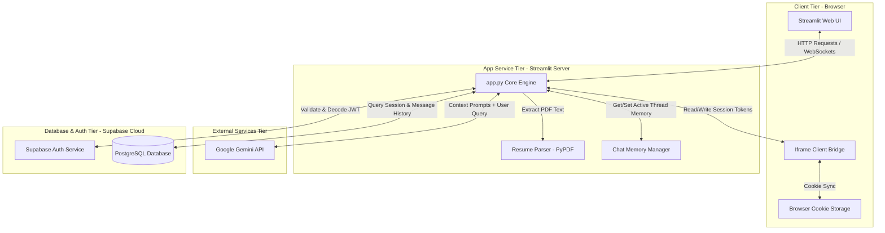

# Lyra – AI-Powered Conversational Assistant & Study Companion
**Project Report**

---

## 1. Introduction

### Project Title
**Lyra – AI-Powered Conversational Assistant**

### Objective
Lyra is an AI-powered conversational assistant developed using Streamlit, Supabase, and Google Gemini Large Language Models (LLMs) to provide context-aware, specialized study and career assistance. The goal of this project was to build a user-friendly assistant capable of maintaining secure, persistent conversation histories, handling document uploads (such as resumes), and offering domain-specific guidance modes in an immersive, modern user interface.

---

## 2. Problem Statement

Standard conversational interfaces face several technical and practical limitations:
* **Statelessness:** Traditional lightweight web apps do not save chat history across browser restarts or page refreshes.
* **Lack of User Isolation:** Maintaining conversation history for multiple users securely requires robust user accounts and secure database integrations.
* **Authentication Storage Barriers:** Deploying python-based interfaces like Streamlit in iframe-sandboxed environments (like Streamlit Community Cloud) restricts typical browser storage (`localStorage`) access due to security restrictions.
* **Generic LLM Prompts:** General-purpose AI tools lack specialized role constraints, making them less effective for focused tasks like active-recall studying, code debugging, or PDF resume reviews.

---

## 3. Technologies Used

| Technology | Purpose |
| :--- | :--- |
| **Streamlit (Python)** | Framework for the user interface and application engine |
| **Supabase (PostgreSQL)** | Persistent cloud database to store user records, chat sessions, and message history |
| **Supabase Auth** | Secure user registration and email/password authentication |
| **Google Gemini 2.5 Flash** | Large Language Model backend for generating contextual, grounded responses |
| **`streamlit-cookies-controller`** | Cross-domain cookie manager used to bypass browser iframe sandboxing for session persistence |
| **PyPDF** | Library for reading and extracting raw text from uploaded PDF resumes |
| **HTML5 & Custom CSS** | Embedded styling for a modern glassmorphic dark interface |

---

## 4. System Architecture



### Component Details
1. **Client Tier:** The user interacts with the **Streamlit Web UI**. The browser storage handles secure tokens in **Cookies**, which are read/written by a hidden Javascript bridge to bypass iframe blocks.
2. **App Service Tier:** The Python engine (**`app.py`**) coordinates operations, parses PDF files using **PyPDF**, and loads the chat state from the **Memory Manager**.
3. **Database & Auth Tier:** **Supabase Auth** handles user verification and JWT token checks, while **Supabase PostgreSQL** stores tables for users, sessions, and messages securely behind Row Level Security (RLS).
4. **External Services Tier:** The **Google Gemini 2.5 Flash** backend processes system rules and context prompts to return conversational responses.

---

## 5. Features Implemented

* **Secure Authentication & Session Persistence:** Users can register and sign in securely. Login status persists across page refreshes and browser restarts using secure cookie token exchange.
  
  > [NOTE]
  > **[INSERT SCREENSHOT: Registration and Login tab container UI on startup]**
  
* **Multi-session Conversation History:** Users can create multiple separate chat threads ("New Chat"), name them, select past conversations from the sidebar, or delete old sessions.
* **Domain-Specific Assistant Modes:** Provides specialized modes: General Assistant, Study Buddy, DSA Helper, Career Mentor, Space Mentor, and Resume Reviewer.
* **Resume Parsing & Evaluation:** Extracted text from uploaded PDF resumes is scanned by PyPDF and critiqued by the LLM, giving users actionable improvements.
  
  > [NOTE]
  > **[INSERT SCREENSHOT: Resume Reviewer mode active, showing the PDF upload widget in the sidebar]**
  
* **Database Row Level Security (RLS):** Implemented PostgreSQL database-level policies ensuring users can only read, write, or delete their own chat sessions and histories.
* **Premium Glassmorphic Dark UI:** Utilizes cohesive styling with glowing gradients, glowing hover states, and smooth layouts.
  
  > [NOTE]
  > **[INSERT SCREENSHOT: Main chat window showing the glowing glassmorphic card design and dark theme styling]**

---

## 6. Working of the Chatbot

```
[User Login/Token Restore] 
           ↓
[Select Specialized Mode & Input Text/PDF]
           ↓
[Backend reads Session History from Supabase Database]
           ↓
[Construct Prompt: System Instructions + History + User Query]
           ↓
[Query Gemini LLM API & Retrieve Response]
           ↓
[Save Query and Response to Supabase Conversations Table]
           ↓
[Render Response on Chat Interface]
```

1. **Startup Check:** On initial load, the app checks the browser cookies. If `lyra_access_token` and `lyra_refresh_token` are found, it authenticates the user with Supabase Auth.
2. **Setup Prompt:** When a user enters a query, the backend reads the active chat mode (e.g., DSA Helper) and loads the matching System Prompt.
3. **Inject History:** It queries the Supabase database to fetch the last few messages in the active thread to maintain conversational context.
4. **Generate & Display:** The combined prompt is sent to Google Gemini 2.5 Flash. The response is displayed in the chat interface and appended to the `conversations` table.

---

## 7. Challenges Faced & Solutions

* **Challenge 1: Iframe Sandboxing in Streamlit Cloud**
  * *Problem:* Standard JavaScript `localStorage` writes failed inside `st.html()` blocks because browsers sandbox Streamlit Cloud component subdomains, throwing strict `SecurityError` exceptions.
  * *Solution:* Implemented `streamlit-cookies-controller` to store Supabase Auth JWTs. This component uses cross-domain safe `window.postMessage` to store cookies in the parent window, allowing the Python backend to read and restore authentication state.
* **Challenge 2: Database Write Failures (Row-Level Security)**
  * *Problem:* Inserting users and sessions failed silently on the server, causing conversation history to disappear on page reload. Debugging revealed that the Supabase PostgreSQL database blocked inserts because RLS was enabled but had no policies for the `anon` API key.
  * *Solution:* Created explicit Row-Level Security policies on the `users`, `sessions`, and `conversations` tables using `auth.uid() = user_id`. This secured user data while allowing authenticated client sessions to read and write.

---

## 8. Results

The application successfully manages authentication, preserves user data, and delivers responses through a clean interface:
* **Startup & Persistence:** The application successfully maintains persistent conversations across sessions and restores user authentication automatically after browser refreshes.
  
  > [NOTE]
  > **[INSERT SCREENSHOT: Welcome Card view showing the specialized modes list upon fresh login]**
  
* **Sidebar:** Dynamically lists the user's historical chat sessions. Clicking a session instantly loads the respective conversation history from the database.
  
  > [NOTE]
  > **[INSERT SCREENSHOT: Sidebar view showing the user's active historical conversation list and 'New Chat' button]**
  
* **Performance:** Google Gemini 2.5 Flash generates answers fast, while the PyPDF parsing handles resume review workloads reliably.
  
  > [NOTE]
  > **[INSERT SCREENSHOT: Sample conversation flow with DSA Helper mode active or Resume critique output]**

---

## 9. Future Improvements

* **Multi-modal Inputs:** Allow users to upload images, diagrams, or spreadsheets alongside text for math and code analysis.
* **Real-time Session Sharing:** Allow users to share chat sessions or collaborate on code review sessions with a link.
* **Voice Synthesis:** Introduce Text-to-Speech (TTS) capabilities to read study notes aloud.
* **Offline Local Mode:** Support connecting to locally running models (like Ollama) for developers working without internet connections.

---

## 10. Conclusion

Lyra demonstrates the integration of modern cloud services (Supabase Auth and PostgreSQL) and advanced Large Language Models (Gemini) inside Streamlit. By resolving deep-seated browser permission challenges and database security policies, Lyra serves as a secure, fast, and multi-functional educational assistant.
